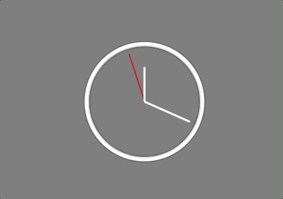
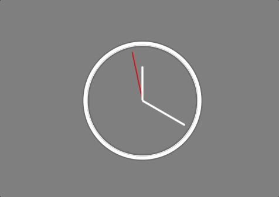

# [JavaScript30] CSS + JS CLOCK

바닐라 자바스크립트를 처음으로 새로 공부하는 의미에서, 작은 시계 기능을 구현하는 코드를 작성했습니다.

## 📍 적용하고 공부한 개념

### let, const, var

- var: 변수를 선언. 추가로 동시에 값을 초기화
- let: 블록범위(scope)지역 변수 선언. 추가로 동시에 값을 초기화
- const: 블록범위 읽기 전용 상수 선언

변수가 재할당되는 것을 방지하기 위해, var보다는 let과 const로 변수를 선언했습니다.

## 📍 발생 문제

초침의 css에 transition를 설정하니, 초침이 59 -> 0으로 바뀌면서 뒤로 돌아가는 문제가 있었습니다. 이에 매초 초침의 값을 재할당하는 것이 아니라, 처음에만 할당하고 계속 값을 누적하는 방식으로 해결했습니다.

```css
.hand {
  width: 50%;
  height: 6px;
  background: white;
  position: absolute;
  top: 50%;
  border-radius: 10px;
  transform-origin: 100%;
  transition: all 0.05s;
  transition-timing-function: csubic-bezier(0.28, 0.79, 0.36, 1.18);
}
```

수정 전

```javascript
function getDate() {
  // 초침
  const now = new Date();
  let seconds = now.getSeconds();
  const secondDeg = (seconds / 60) * 360 + 90;
  const secondHand = document.querySelector(".second-hand");
  secondHand.style.transform = `rotate(${secondDeg}deg)`;
}

setInterval(getDate, 1000);
```

수정 후

```javascript
const now = new Date();
let seconds = now.getSeconds();
// 초를 매초마다 재할당
// 변수를 계속 수정하므로, const로 변수할당 시 error가 발생합니다.

function getDate() {
  // 초침
  seconds++;
  const secondDeg = (seconds / 60) * 360 + 90;
  const secondHand = document.querySelector(".second-hand");
  secondHand.style.transform = `rotate(${secondDeg}deg)`;
}

setInterval(getDate, 1000);
```

## 📍 결과물

|                             BEFORE                             |                             AFTER                              |
| :------------------------------------------------------------: | :------------------------------------------------------------: |
|  |  |

## 📍 느낌점

React 프레임워크를 활용하여 프로젝트를 할때, JavaScipt를 짧게나마 공부했으나 이후 부족함을 많이 느끼게 되어 스터디를 시작하게 되었습니다. 이렇게 작은 다양한 기능들을 구현하면서, 자바스크립트에 대한 이론/개념적인 부분에 대해 더 입체적으로 이해하고, 이후 프론트엔드 개발자로 성장하기 위한 기반을 만들어 나가겠습니다.

> 출처: https://javascript30.com/

> 참고: https://developer.mozilla.org/ko/docs/Web/JavaScript/Guide/Grammar_and_Types
